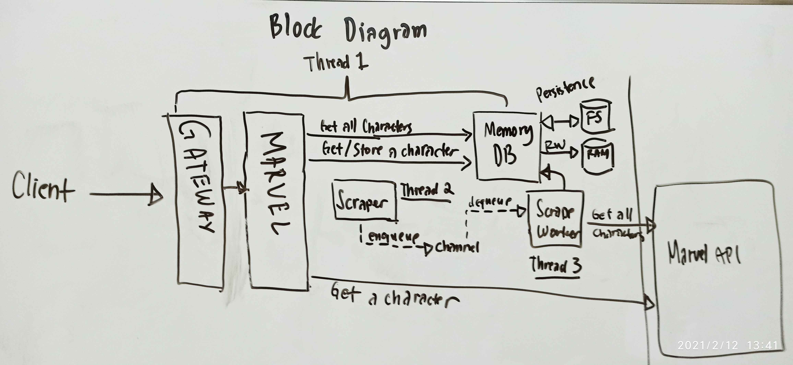

# Marvel Characters

[](https://marvel.ghabxph.info)
[](https://github.com/ghabxph)
[](https://github.com/ghabxph/marvel-xendit)

Just a simple tool that fetches all characters from official marvel  api.  Developed  with
love by yours truly.

## Requirements

* GNU Make (optional)
* Either:
  * Go 1.15
* Or:
  * Docker
  * Docker Compose
  
## API Documentation

Our API is documented using Swagger OpenAPI. The documentation is served within  the  app.
The root (/) route shall redirect you to the  API  documentation  and  teach  you  how  to
consume this endpoint.

## Building and running the application

Clone our repository:

``` sh
# Clones our source code into marvel folder
git clone https://github.com/ghabxph/marvel-xendit.git marvel
```

First, you need to be a [marvel developer](https://developer.marvel.com/) and get your app
key and secret. Then create a `config.yaml` file in this directory.

``` yaml
# Marvel App Key
public_key: "<your-marvel-app-key>"

# Marvel Secret Key
private_key: "<your-marvel-secret-key"
```

You got two options: Use docker or to build the application by yourself.  We  utilize  GNU
Make to make things very convenient for you. Note that before doing the next steps  below,
be sure that `config.yaml` file is present or things will simply fall apart.

### With Docker

Simply run `make dock-build dock-up` to build and run the docker container. If  you  don't
have GNU Make installed on your machine, then simply  execute  the  commands  manually  by
yourself.

``` sh

# Builds the docker container
docker-compose build

# Runs the docker container
docker-compose up
```

### Without Docker

Simply run `make clean build run` to create a clean build and run your application at  the
same time. If you don't have GNU Make installed on your machine, then simply  execute  the
commands manually by yourself.

``` sh

# Removes existing bin folder
rm -fvr ./bin

# Builds the application
go build -o bin/marvel ./cmd/marvel

# Runs the application
./bin/marvel
```

*(Shortcut: `make clean run` does the same thing, but I want to show you the full process)*
  
## Running the test

Simply run `make test` to run the test for the four important parts of our program, or  if
you don't have GNU Make installed on your machine, then you can run the test for yourself.

``` sh

# Tests the HTTP endpoint
go test ./internal/gateway

# Tests our main business logic
go test ./internal/marvel

# Tests our in-memory cache
go test ./internal/memorydb

# Tests our scraper
go test ./internal/scraper
```

# How things work

This is a one-binary application. The architechture of this design is defined in the block
diagram below.



The application is composed of 4 major components: `gateway`,  `marvel`,  `memorydb`,  and
`scraper`. We have two main caching strategies: Cache-aside and scraping data in  advanced
behind the scenes.

## Cache-aside Strategy


Our cache-aside strategy is triggered  by  `characters/{id}`.  When  client  requests  for
specific character with given ID, `marvel` will check the  data  first  on  `memorydb`  if
there's  a  hit.  If  it's  a  miss,  then  `marvel`  will  request  for  live   data   on
[official marvel endpoint](https://gateway.marvel.com/)  and  then  caches  the  data  and
serves the fresh data to user. And then if user requests the  same  item  again,  `marvel`
will serve the item from the cache / `memorydb`.

## Scraping

We implemented a scraper that runs on the background everyday same time when  the  program
is executed. We implemented this in anticipation that Marvel will update  the  information
about their characters from time to time, so it is rational to implement this.

## Keeping things persistent

In an event where server might crash for some  various  reason,  or  the  application  was
intentionally  terminated,  we  implemented  a  persistence  by  creating  json  files  in
`./.characters` folder in the current working directory. Persistence  happens  every  time
there's a call in `memorydb.GetInstance().CreateCharacter(...)`  function.  We  read  data
from the persistence just once upon start of the program.

## Application's flow of execution

1. Loads persistence data to MemoryDB
2. Starts the scraper in the background (go routine)
3. Serves the HTTP Endpoint (Gateway)

# Contribution Guide

Feel free to fork this application and make your  modifications.  If  you're  generous  to
share it to us, feel free to open a ticket and send us a pull request.
